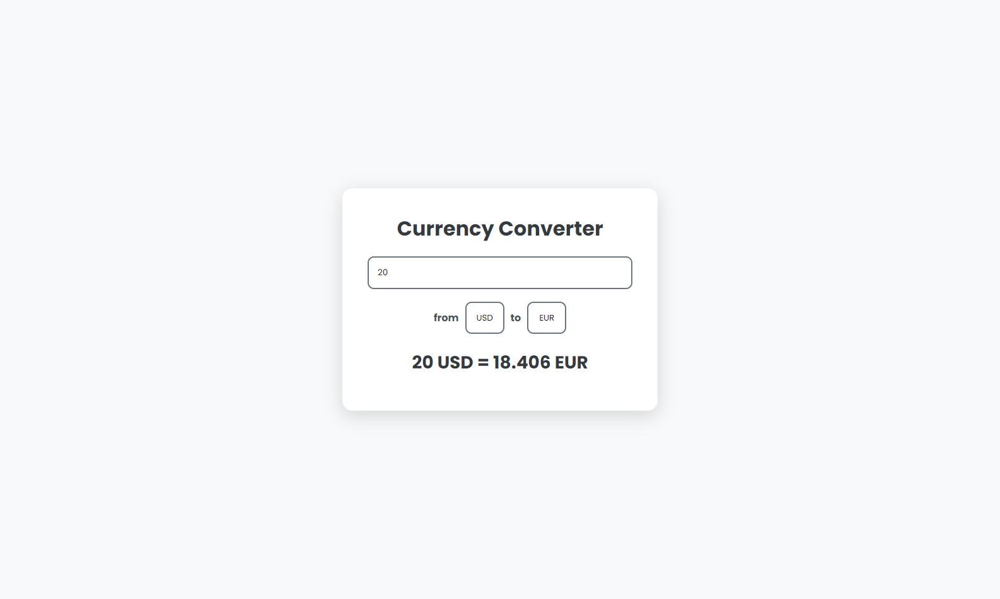

# Currency Converter App 🌍💱

## Description 📜

The Currency Converter App is a user-friendly web application that enables users to convert amounts between different currencies in real-time using the Frankfurter API for accurate exchange rates.

## Live Demo 🚀

You can check out the live demo of the application here: [Currency Converter Live](https://currency-convertor-react-mo3bassias-projects.vercel.app)

## Technologies Used ⚙️

- **React**: A JavaScript library for building user interfaces.
- **JavaScript**: The programming language that handles all the logic behind the application.
- **CSS**: Used for styling the application with modern design.
- **Frankfurter API**: Provides real-time currency exchange rates for conversions.
- **useState**: React Hook for managing component state.
- **useEffect**: React Hook for handling side effects, such as fetching data from the API.
- **Async/Await**: Used for handling asynchronous API calls for currency conversion and fetching available currencies.
- **Fetch API**: For making network requests to the Frankfurter API to retrieve exchange rates.

## Code Overview 🖥️

The core functionality of the application is built around the following components:

- **App Component**:

  - Manages the state for selected currencies, the currency value, and the conversion result.
  - Uses two `useEffect` hooks:
    - The first one handles currency conversion when the selection or value changes.
    - The second one fetches all available currencies on component mount.

- **Container Component**:

  - A functional component that wraps the main content for styling.

- **OptionsCurrencies Component**:
  - Renders the available currency options in the select dropdowns, iterating over `allCurrencies`.

### Key Functions:

- **fetchData(e)**: Updates the `currencyValue` state based on user input.
- **convert()**: An async function that fetches conversion rates and updates the `result`.
- **getAllCurrencies()**: An async function that fetches all available currencies to populate the select boxes.

## Contribution 🤝

Contributions are welcome! If you'd like to help improve the project, feel free to open issues or submit pull requests.
